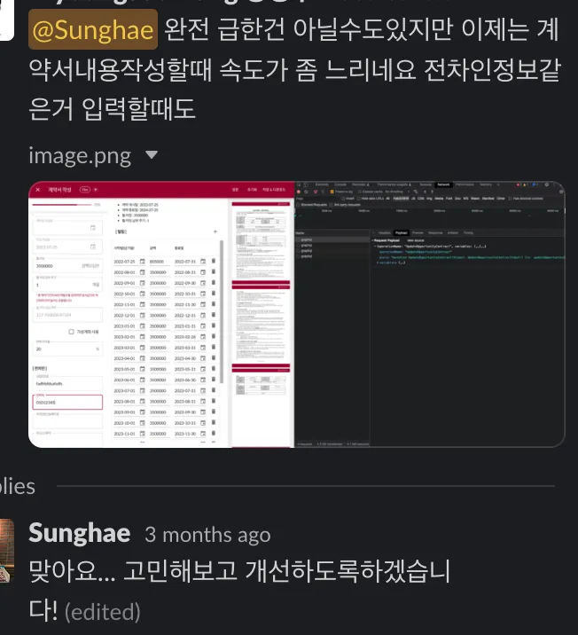

동료 개발자로부터 기획 첫 단계부터 내가 맡아서 진행해온 계약서 작성 기능이 너무 느려서 개선이 필요할 것 같다 라는 피드백을 받았다. 사실 나도 인지하고 있던 부분이였기에 이번 기회를 통해 `React.memo` `useCallback` `useMemo` 를 사용하여 성능 개선 최적화를 진행한 과정을 작성해보려한다.

## # Introduction
React Developer Tools를 통해 인풋의 onChange가 일어날 때마다 어떻게 렌더링되는지 확인해봤다. onChange 통해 인풋이 렌더링될 것이고 그로 인해 부모 컴포넌트도 렌더링될 것은 어느정도 알고 있었지만 시각적으로 확인해보니 그 정도가 너무 심했다.

컴포넌트가 렌더링하는 규칙에는 크게 3가지가 있다.
* state나 props가 변경되었을 때
* 부모 컴포넌트가 렌더링되었을 때
* `forceUpdate()` 를 실행했을 때

인풋은 계약서 작성 컴포넌트의 최하단에 위치해있었고 인풋의 state는 최상단에서 관리되고 있었다. **렌더링 규칙의 1번의 이유로 인해 onChange가 일어날 때마다 계약서 작성의 모든 컴포넌트들이 렌더링**되고 있던 것이다.

## # React의 Memoization

> 메모이제이션(memoization)은 컴퓨터 프로그램이 동일한 계산을 반복해야 할 때, 이전에 계산한 값을 메모리에 저장함으로써 동일한 계산의 반복 수행을 제거하여 프로그램 실행 속도를 빠르게 하는 기술이다. 동적 계획법의 핵심이 되는 기술이다.[(위키백과)](https://ko.wikipedia.org/wiki/%EB%A9%94%EB%AA%A8%EC%9D%B4%EC%A0%9C%EC%9D%B4%EC%85%98)

즉, 우리가 메모이제이션을 통해 두 가지의 결과를 기대할 수 있다.
* 복잡한 연산의 반복을 피하여 성능 향상
* 안정된 값 제공

리액트에서는 메모이제이션을 위해 3개의 api `React.memo` `useCallback` `useMemo` 를 제공하며 **이전의 값만 메모이제이션** 한다는 특징이 있다.

그럼 각각의 사용법과 차이점 그리고 내가 프로젝트에서 어떻게 활용했는지에 대해 알아보자.!

## # React.memo

```js
const InputWrapper = ({ label, value, onChange }) => {
  return (
    <Input value={value} onChange={onChange} />
  )
}
export default memo(InputWrapper)
```

React.memo는 컴포넌트를 감싸는 형태로 사용한다. InputRenderer의 리턴값이 React.memo로 인해 메모리에 저장되고 props를 비교해 값이 동일하다면 메모이징 된 값을 재사용해 불필요한 렌더를 막는다.

이때 props는 얕은 비교를 통해 비교하는데 string, number 등의 **원시 자료형은 같은 값을 갖는지**, 배열, 객체 등의 **참조 자료형은 참조값이 같은지** 확인한다.

하지만 최적화를 위해 모든 컴포넌트를 React.memo로 감싸는건 어떨까? 과연 최적화에 도움이 될까? <br />
대답은 **NO**❗️그 이유는 이를 위한 메모리 비용이 추가로 필요하게 되고 최적화를 위한 연산이 불필요한 경우에는 메모리 비용만 발생시키기 때문이다.

그럼 언제 React.memo를 사용할까?

```js
const InputWrapper = ({ label, value, onChange }) => {
  return (
    <div>
      {label} :
      <Input value={value} onChange={onChange} />
    </div>
  )
}
export default InputWrapper

/*  value, onChange는 동일하다고 가정
	Input은 label은 시간차를 두고 업데이트 된다고 가정
*/
<InputWrapper
  label="input1" 
  value={value}
  onChange={e => handleChange(e)} 
/>
    
<InputWrapper
  label="input2" 
  value={value}
  onChange={e => handleChange(e)} 
/>
    
<InputWrapper
  label="input3" 
  value={value}
  onChange={e => handleChange(e)} 
/> 
```

React.memo를 써야하는 경우는 **동일한 props로 자주 렌더링되는 경우**이다.
위와 예시에서 label이 업데이트 될 때마다 InputWrapper 컴포넌트는 리렌더링되며 InputWrapper 안에 있는 Input은 변경되는 값이 없음에도 불구하고 함께 리렌더링된다. 이러한 경우에 React.memo를 사용하면 불필요한 렌더링을 막을 수 있다.

### React.memo와 콜백함수
React.memo로 감싼 컴포넌트에 동일한 props가 전달되더라도 리렌더링이 되는 경우가 있는데, 바로 **콜백함수로 인라인 함수를 전달**하기 때문이다.
<br />

InputWrapper 로 넘기는 props 중 onChange를 보면 인라인함수로 전달고 있다. InputWrapper 가 리렌더링될 때마다 onChange 는 새로운 참조값을 갖게 되어 Input 컴포넌트에서는 props가 다르다고 판단해 리렌더링을 일으키게 된다.
<br />

그래서 다음과 같이 **인라인 함수가 아닌 함수를 바로 넘겨**주어야 한다. 이 방법과 더불어 **해당 함수를 `useCallback`로 감싸야만 완벽하게 리렌더링을 발생하지 않는다.** 이 부분은 하단의 useCallback 부분에서 추가적으로 설명하겠다.

```js
<InputWrapper
  label="input1" 
  value={value}
  onChange={handleChange} 
/>  
```

## # useCallback? useMemo?
useCallback과 useMemo모두 메모이제이션된 값을 반환한다. useCallback은 함수를 useMemo는 값을 리턴하며 deps가 바뀔때마다 새로운 객체를 생성한다.

```js
const memoizedCallback = useCallback(
  () => {
    doSomething(a, b);
  },
  [a, b],
);

const memoizedValue = useMemo(() => computeExpensiveValue(a, b), [a, b]);
```

위에서 React.memo로 메모이제이션 된 컴포넌트의 props로 함수를 바로 넘기는 것과 동시에 해당 함수로 useCallback으로 감싸야지 완벽하게 렌더링을 방지할 수 있다고 했다.
<br />

함수 역시 객체이기 때문에 얕은 복사를 통해 참조값이 같은지 비교를 하게 된다. 그래서 handleChange를 useCallback으로 감싸주어 InputWrapper가 렌더링되는 문제를 해결할 수 있다.

## # 정리
위에서 말한것과 같이 무분별하게 사용하는 것은 오히려 메모리 비용만 발생시키게 된다. 많은 블로그에서는 일단 개발하고 최적화가 필요한 시점에 최적화를 하라고 말하고 있다.
<br />

이번 기회를 통해 그동안 무분별하게 사용했던 useCallback을 좀 더 효율적으로 사용할 수 있게 되었고 useCallback과 useMemo의 차이점에 대해서도 명확하게 알 수 있었다.
<br />

한가지 아쉬운 점은 최적화하기 전에 react dev tool를 통해 성능 확인한 결과를 저장하지않아서 수치적으로 얼마나 많이 개선되었는지 알 수 없다는 점이다. 하지만 우리 팀 모두가 확인했을 때 시각적으로 빨라진 걸 느낄 수 있었고 처음 성능 개선한 결과로서는 개인적으로 만족스럽다!

<br />

[참조 |React.memo() 현명하게 사용하기](https://ui.toast.com/weekly-pick/ko_20190731) <br />
[참조 | 참조 동일성을 위한 메모이제이션](https://yceffort.kr/2022/04/memo-for-referential-stability-in-react) <br />
[참조 | React.memo, useCallback 사용으로 렌더링 최적화 하기](https://velog.io/@shin6403/React.memo-useCallback-%EC%82%AC%EC%9A%A9%EC%9C%BC%EB%A1%9C-%EB%A0%8C%EB%8D%94%EB%A7%81-%EC%B5%9C%EC%A0%81%ED%99%94-%ED%95%98%EA%B8%B0feat.React-NativeRedux#reactmemo-usecallback%EC%9C%BC%EB%A1%9C-%EB%A0%8C%EB%8D%94%EB%A7%81-%EC%B5%9C%EC%A0%81%ED%99%94-%EC%84%B1%EB%8A%A5-%ED%85%8C%EC%8A%A4%ED%8A%B8%ED%95%98%EA%B8%B0)